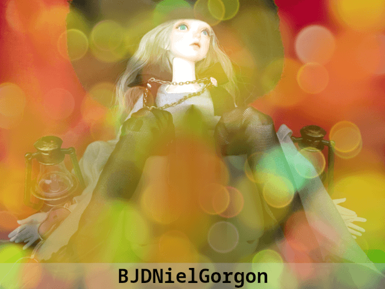

# BJDNielGorgon

**BJDNielGorgon** is one of the **BJDNielSounds** collection created with BJD **Niel**, a witch, session player and psychotherapist for GoldRock.

>_The **Poet's Village**, it was a strange village where her foot arrived. This village, where humans and dwarves, elves, gnomes, goblins, trolls, and other various races live. Finally she found a place where she could settle down. She laughed, and talked with the villagers. Drinking..., singing..., she was happy._
>
>_But one day, dangerous monster **Gorgon** invaded the village. Niel turned on the lamps at the entrance of the village and desperately defense Gorgon. The lamps was thrown on the ground, and Niel lost her arms. But she did not give up, she fought with Gorgon for the villagers, and herself. Finally, Gorgon fell to Niels magic._
>
>_**-The End-**_

## Specification

**BJDNielGorgon** is a sexual loop impulse samples available with sound sampler and **[SoundFont synths](https://www.fluidsynth.org/)**. The loops includes three sound samples such as vibrator and the Gorgons spike.

All sound samples are made with **24bit**, **192Kbps WAV** format. The SoundFont root key is 36, 38, 39, and the key range is 24-127.

**This loops is not made by abusing Niel.**

## Usage

- Download `BJDNielGorgon.tar.gz` on Releases, extract where you want, then import the samples on your sampler or import `BJDNielGorgon.sf2` on your SoundFont synth.

## Made in Korea, Republic of.

##### Working With

- Yi Yunseok
- LoveSmithToys Tattooed Elf FTM Masturbator, Stheno Tail, NuclearVibe
- Raspberry Pi, PiSound, Behringer Micro series and Monitor1
- Musicus B-free2.0, Audio-Technica AT2035, OneOdio Pro-50
- [RasPiOS](https://www.raspberrypi.com/software/), [Audacity](https://www.audacityteam.org/), [Cava](https://github.com/karlstav/cava), [Polyphone](https://www.polyphone-soundfonts.com/)

###### Tested With

- M-Vave SMK-25
- [Ardour](https://ardour.org/), [ACE plugins](https://manual.ardour.org/plugins-filters/), [ChowCentaur](https://github.com/jatinchowdhury18/KlonCentaur), [ChowMatrix](https://github.com/Chowdhury-DSP/ChowMatrix), [EasySSP](https://au.tomatl.org/)

_BJDNielSounds ©️ 2023 by Yi Yunseok is licensed under **[CC-BY-SA 4.0](https://creativecommons.org/licenses/by-sa/4.0/)**. Made with 💝 and **[Niel](https://s.click.aliexpress.com/e/_oDj63f7)**, proudly hosted on **[GitHub](https://github.com/)**._

