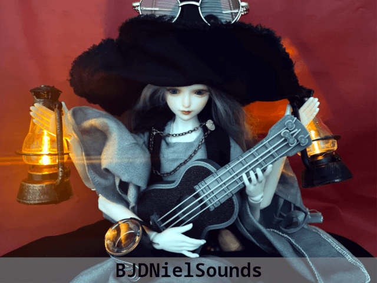

# BJDNielSounds

**BJDNielSounds** is an sound collection created with BJD(Ball-Jointed Doll) **Niel**, a witch, session player and psychotherapist for GoldRock.

>_This is the story of **Niel**, a witch, who defeated **Gorgon** and protected the **Poet's Village**._
>
>_A long long time ago, a baby was born in the eyes of the storm. The baby was abandoned in a village from her parents, and the **Tracey**, the only one that she was believed he is a dad, he raised her with devotion. He named the her **Niel**._
>
>_However, because born with four arms, Niel was different from other childs. So Tracey made a lot of efforts to avoid being discriminated against. Fortunately, thanks to his efforts, Niel was a bright and happy child. The villagers also seemed to like her._
>
>_By the time she became a naughty girl, Tracey taught her astrology and flame magic spells, self-defense techniques, some instruments._

_[Continue in the next chapter...](https://github.com/YGGDRASIL-STUDIO/BJDNielSounds/tree/main/BJDNielKalimba)_

## Instruments

- [BJDNielKalimba](BJDNielKalimba) - 8-key Kalimba SoundFont for SF2 synths, it also contains tremolo Kalimba bank.
- [BJDNielRajiao](BJDNielRajiao) - 4-String Arp-Bass SoundFont based on Miniature Ukulele.
- [BJDNielPercussions](BJDNielPercussions) - Percussion Pack for SFZ synths and Hydrogen drum machine.
- [BJDNielGorgon](BJDNielGorgon) - Sexual loop impulse samples for sound sampler, and SoundFont for SF2 synths.

>Not just samples, all instruments are **ready to use**.

### Sponsors

You can support this project or present clothes to Niel. Please tell me your profile link when you support this project.

#### Users

Please tell me where you used BJDNielSounds.

##### Get BJD Niel

Please visit here if you want your **[Niel](https://s.click.aliexpress.com/e/_oDj63f7)**.

###### TODO

- [x] BJDNielGorgon
- [x] BJDNielKalimba
- [x] BJDNielPercussions
- [x] BJDNielRajiao
- [ ] GitHub Page
- [ ] Publish on itch
- [ ] Publish on Polyphone
- [ ] Publish on KVR
- [ ] Publish on Bandcamp
- [ ] Publish on Myspace
- [ ] Publish on SoundCloud

_BJDNielSounds :copyright: 2023 by Yi Yunseok is licensed under **[CC-BY-SA 4.0](https://creativecommons.org/licenses/by-sa/4.0/)**. Made with :heart: and **[Niel](https://s.click.aliexpress.com/e/_oDj63f7)**, proudly hosted on **[GitHub](https://github.com/)**._
